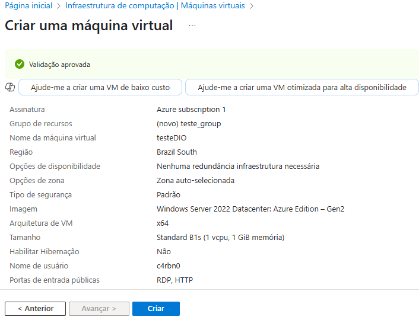
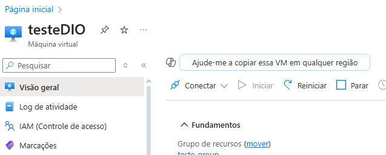
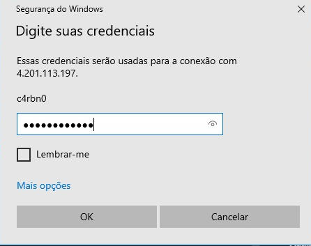

# Desafio DIO: Criação de Máquina Virtual no Azure

## Criando Virtual Machine

 - Na tela inicial do portal do Azure, pesquise por **Máquinas Virtuais**.
 - Na página de VMs, clique em **Criar** e selecione **Máquina virtual do Azure** para começar a configurar a VM.
.
 - Escolha um nome para a VM, selecione a **region** onde ela será hospedada e escolha o sistema operacional a ser utilizado.
 - Escolha sua **zone** de acordo com a necessidade e criticidade do seu projeto.

- Defina nome de usuario e senha para poder efetuar login posteriomente.

- Selecione as portas de entrada. Sempre selecione a porta RDP (3389) para ter acesso à interface gráfica da máquina virtual, especialmente se estiver usando o sistema Windows.

    - SSH (22): usada para acessar remotamente máquinas Linux através de um terminal
    - HTTP (80): permite que sua VM atue como servidor de um site acessado via "http://" (sem criptografia)
    - HTTPS (443): usada para hospedar sites seguros, acessados via "https://" (criptografados)

- Pronto. agora clique em **Revisar + criar**. Após a criação selecione **Ir para o recurso**.

### Acessando a virtual machine

- clique em conectar.

- Agora baixe o **arquivo `.RDP`** e após o termino da instalação abra o arquivo

- Basta usar as informações de login selecionadas anteriormente e entar na VM.

